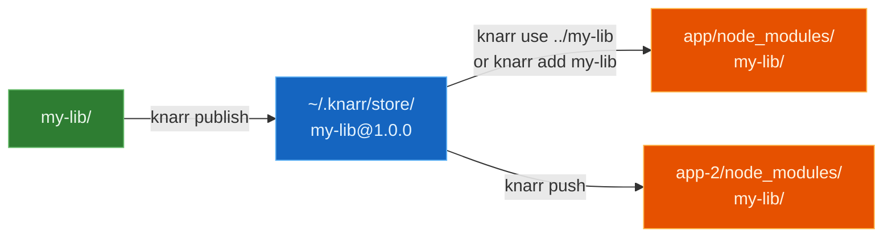

<p align="center">
  
</p>

<p align="center">
  <a href="https://www.npmjs.com/package/knarr"></a>
  <a href="https://www.npmjs.com/package/knarr"></a>
  <a href="https://www.npmjs.com/package/knarr"></a>
  <a href="https://bundlephobia.com/package/knarr"></a>
  <br>
  <a href="https://github.com/oleg-kuibar/knarr/actions/workflows/ci.yml"></a>
  <a href="https://github.com/oleg-kuibar/knarr/actions/workflows/compat.yml"></a>
  <a href="https://github.com/oleg-kuibar/knarr/blob/master/LICENSE"></a>
  
</p>

# Knarr

Test local npm packages in real apps without `npm link` symlink surprises or local package references in `package.json`.

Knarr copies the package files you would publish into the consumer app's `node_modules/`, then keeps registered consumers updated. It detects npm, pnpm, Bun, and Yarn projects that use `node_modules` or Yarn's pnpm linker. Yarn PnP is not compatible because it removes `node_modules`.

```bash
cd my-app
npx knarr use ../my-lib

cd ../my-lib
knarr dev
```

If you have not installed Knarr globally, use `npx knarr dev` for the second command too.


## Who this is for

- Library and design-system authors testing packages inside real consumer apps
- React developers avoiding duplicate dependency instances and invalid hook calls from symlinks
- pnpm users who want updates copied into the existing virtual-store install when possible
- Teams that want local package overrides to stay out of dependency specs and lockfiles

## Why Knarr?

`npm link` creates symlinks that can break module resolution: duplicate dependency instances, peer dependency mismatches, and bundlers that cannot follow links outside the project root. yalc improves this by copying files, but its workflow can rewrite consumer dependency specs or require extra watch tooling.

Knarr keeps the local override out of your dependency spec. It publishes a local package into `~/.knarr/store/`, injects that package into every registered consumer, and can watch, rebuild, and push changes continuously. Setup helpers may still add `.knarr/`, `.gitignore`, a restore hook, or bundler config when needed.

If pnpm workspaces, `file:`, or `dependenciesMeta.*.injected` already fit your repo, use those native features first. Knarr is for the narrower case where you want publishable package files copied into real consumers while their dependency specs stay normal.

## Quick Start

One command links a local package into the app you are testing:

```bash
# In your app
cd my-app
npx knarr use ../my-lib
```

Then run the continuous package dev loop from the library:

```bash
# In your library
cd ../my-lib
knarr dev
```

If Knarr is not installed globally, run `npx knarr dev` instead.

That is the everyday loop: edit `my-lib`, Knarr rebuilds it, pushes changed files into `my-app/node_modules/`, and your dev server sees normal file changes there.

If you prefer the explicit steps:

```bash
cd my-lib
pnpm build
knarr publish

cd ../my-app
knarr add my-lib
```

## How It Works



1. `publish` copies built files to a local store at `~/.knarr/store/`
2. `use` publishes from a local path and links it into the current app
3. `add` links an already-published package from the store
4. `push` publishes and copies to all registered consumers
5. `dev` watches, builds, publishes, and pushes continuously

## What Knarr Does

| Area | Behavior |
| --- | --- |
| Store | `~/.knarr/store/<name>@<version>/package/`, or `KNARR_HOME/store/...` when `KNARR_HOME` is set |
| Consumer copy | Copies package files into `node_modules/<package>/` and records link state in `.knarr/state.json` |
| Package files | Uses npm-pack-compatible file resolution, including the `files` field and `publishConfig.directory` |
| pnpm | Follows existing pnpm virtual-store symlinks when present; falls back to a direct `node_modules` path |
| Watch loop | `knarr dev` runs an initial push, then watches, rebuilds, publishes, and pushes again |
| Reinstall recovery | `knarr restore` re-injects registered packages after `node_modules` is replaced |
| Bundlers | Vite plugin triggers reload/restart, Next.js uses `transpilePackages`, Webpack/rspack plugin invalidates watch/cache, and other bundlers rely on file changes under `node_modules` |
| Incremental sync | Skips same size and mtime, hashes same-size changed-mtime files with xxHash64, and removes stale destination files |

See [detailed comparison](docs/comparison.md) for native pnpm options, yalc, symlink workflows, and Knarr tradeoffs.

## Migrate From yalc In 60 Seconds

```bash
cd my-app
npx knarr migrate
npx knarr use ../my-lib

cd ../my-lib
knarr dev
```

See [Migrating from yalc](docs/migrating-from-yalc.md) for the full guide.

## Install

```bash
pnpm add -g knarr       # or npm install -g knarr
npx knarr init          # optional consumer setup and repair helpers
```

## Performance Notes

Knarr uses Node's copy-on-write reflink mode when the current filesystem supports it, with automatic fallback to a normal copy. Reflink support is probed once per volume and cached. Incremental sync checks size and mtime first, then falls back to xxHash64 only when needed, so unchanged files are skipped quickly.

## Documentation

- [Getting Started](docs/getting-started.md)
- [Commands](docs/commands.md)
- [Comparison](docs/comparison.md)
- [Troubleshooting](docs/troubleshooting.md)
- [CI/CD](docs/ci-cd.md)
- [Examples](examples/)
- [Contributing](CONTRIBUTING.md)

Additional guides for bundlers, CI, monorepos, internals, and the experimental programmatic API live in [docs/](docs/).

## Acknowledgments

Knarr is built on top of excellent open-source projects:

- [chokidar](https://github.com/paulmillr/chokidar) - file watching
- [xxhash-wasm](https://github.com/nicolo-ribaudo/xxhash-wasm-legacy) - fast file hashing
- [citty](https://github.com/unjs/citty) - CLI framework
- [tsup](https://github.com/egoist/tsup) - TypeScript bundler
- [vitest](https://vitest.dev) - test runner
- [Vite](https://vite.dev) - frontend tooling

## License

[MIT](LICENSE)
